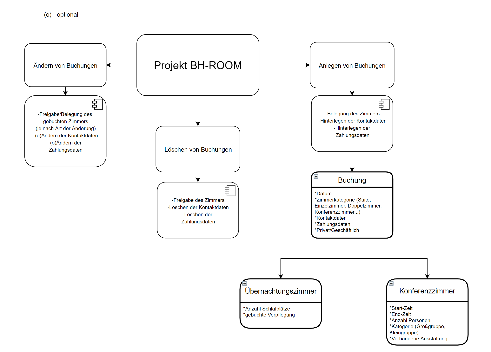
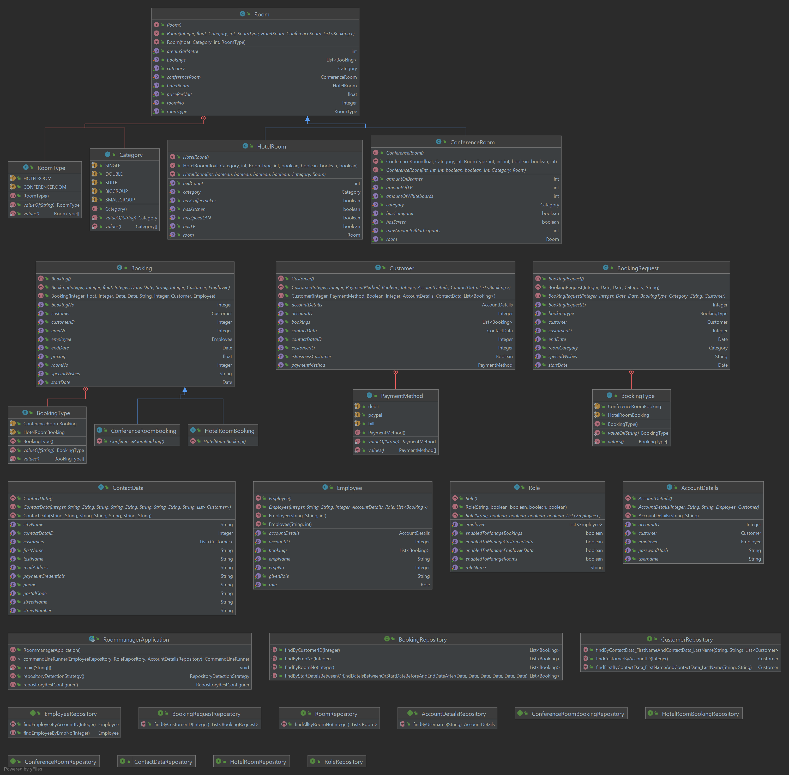
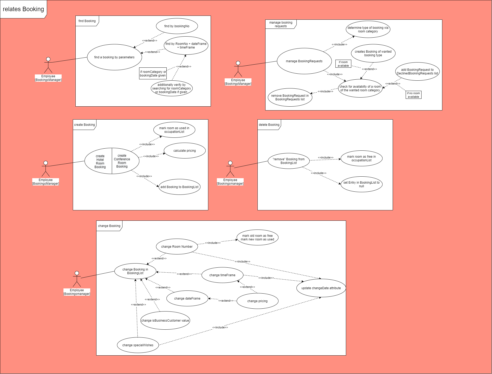
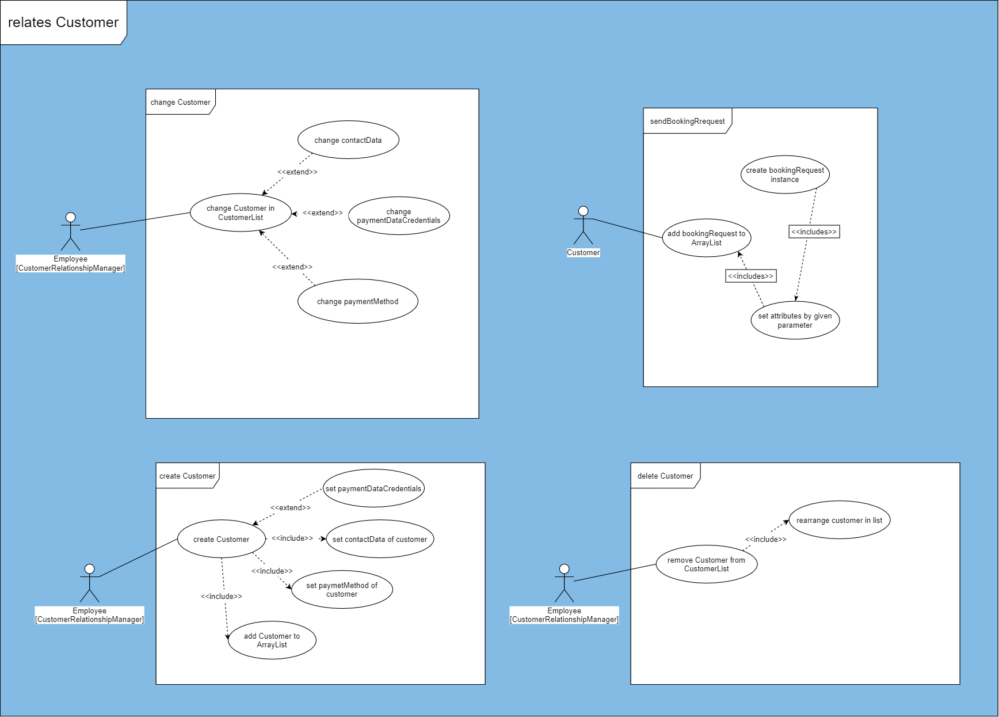
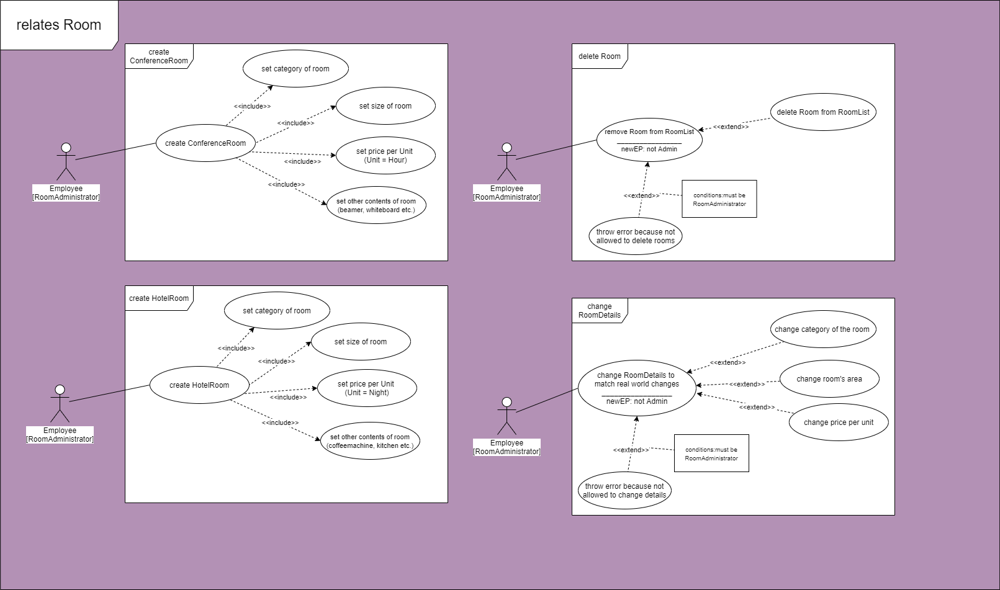

# Businesshotel-Roommanager
Ein Java-Projekt zum Management von Zimmern in einem Businesshotel.<br> 
[](https://github.com/fh-erfurt/Businesshotel-Roommanager/actions)

[](https://github.com/fh-erfurt/Businesshotel-Roommanager/blob/master/LICENSE)

### Dokumentation

___

#### Projektbeschreibung
```

Es soll ein Management-System für die Zimmer eines Businesshotels entwickelt werden. Der Mitarbeiter 
kann im Programm ein Zimmer buchen, dabei wird zwischen Konferenzräumen und Übernachtungszimmern 
unterschieden.
Das System unterstützt bei der Auswahl und schlägt automatisch Zimmer nach gesuchten Kriterien vor.

Ein Hotelzimmer kann für ein Datum belegt oder frei sein. Ein Konferenzraum kann für ein Datum mehrfach 
belegt werden, hier muss der Mitarbeiter nur die Belegung zur jeweiligen Uhrzeit beachten.
Eine Buchung ist in geschäftlich oder privat eingeteilt und enthält Informationen zur Start- und End-Zeit 
sowie Kontaktdaten des Buchenden.
Die Zimmer können verschiedenen Kategorien zugeordnet werden, von Einzel- über Doppelzimmern bis hin 
zu Suiten. Die Konferenzräume unterscheiden sich in Größe und Ausstattung voneinander. Zusätzlich 
gibt es für die Hotelverwaltung die Möglichkeit, die maximale Personenzahl für die Konferenzräume 
anzupassen. So kann flexibel auf die gültigen Corona-Schutzbestimmung reagiert werden. 


```


<details>
<summary> Allgemeine Projektübersicht </summary>
<br>

## Projektteam
* Niklas Wiemuth
* Marius Lange
* Thomas Gebel

## Anforderungsbeschreibung
Grobziele sind:

	- Erstellung und Implementierung eines Raumverwaltungssystem
	- Erstellung und Implementierung eines Buchungsverwaltungssystem
	- Erstellung und Implementierung eines Kundenverwaltungssystem

## Abgrenzungskriterien
Nicht zum Projektumfang gehören:

	- Personalverwaltung
	- Lohnbuchhaltung/Zeiterfassung
	- Rechnung und Mahnwesen
	
</details>


<details>
<summary> Grafiken </summary>
<br>

### Projektübersicht


### Klassendiagramm


### Use Case Diagramme
<details>
<summary>UseCaseDiagramme Booking</summary>



</details>
<details>
<summary>UseCaseDiagramme Customer</summary>



</details>
<details>
<summary>UseCaseDiagramme Room</summary>



</details>	

</details>


<details>
<summary> Meetingprotokolle </summary>
<br>

* [Java 1](Meeting_Protocols/Meetings.md) 
* [Java 2](Meeting_Protocols/Meetings.md)

</details>


<details>
<summary> Verwendete Software </summary>
<br>

* [IntelliJ](https://www.jetbrains.com/de-de/idea/) - IDE für JAVA
* [draw.io](https://app.diagrams.net/) - Tool für die Erstellung der Diagramme
* [lucidchart](https://app.lucidchart.com/) - Tool für die Erstellung der Diagramme
* [Office](https://www.office.com/) - Office Programm
* [Git](https://git-scm.com/) - Versionskontrolle
* [Webex](https://www.webex.com/de/video-conferencing.html) - Kommunikationsmittel für regelmäßige Meetings
* [Telegram](https://telegram.org/) - Kommunikationsmittel zum schnellen Austausch
* [MySQLWorkbench](https://www.mysql.com/de/products/workbench/) - Entwurf der Datenbank und Generierung des SQL Skripts

</details>


