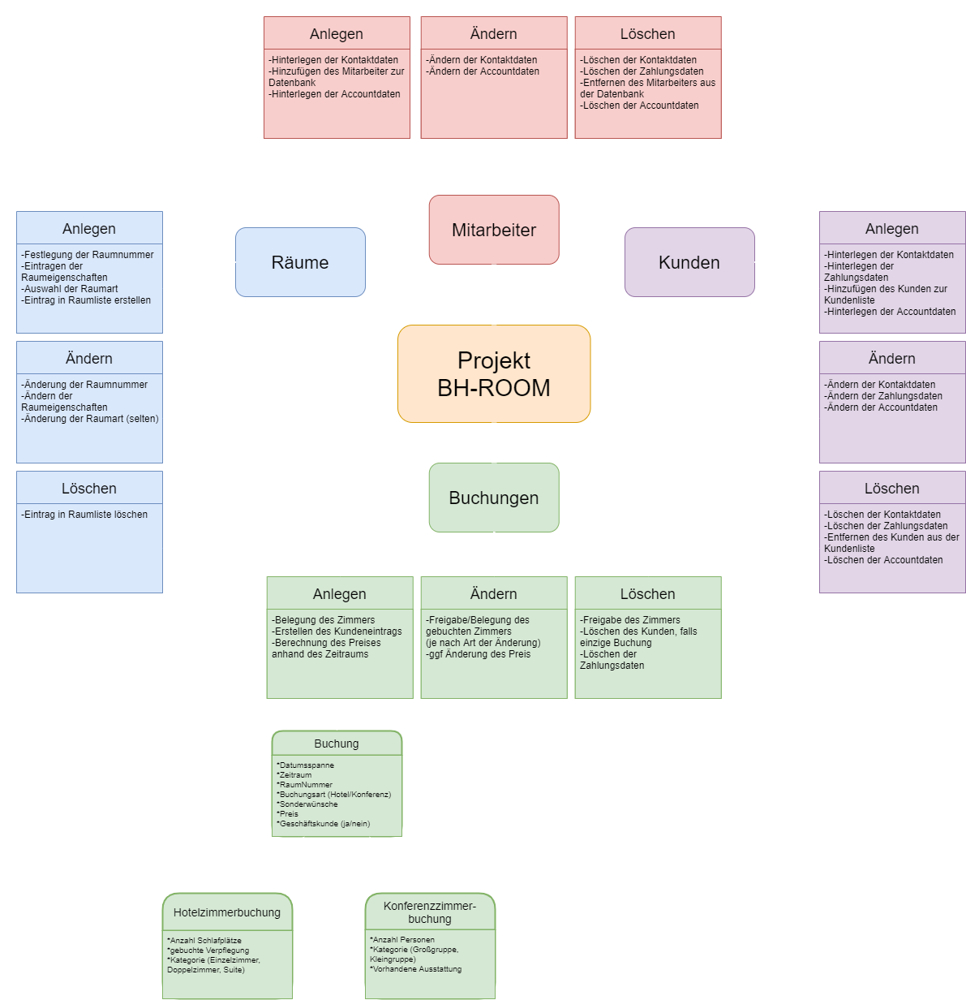

# Businesshotel-Roommanager
Ein Java-Projekt zum Management von Zimmern in einem Businesshotel. 


### Dokumentation

___

#### Projektbeschreibung
```

Es soll ein Management-System für die Zimmer eines Businesshotels entwickelt werden. Der Mitarbeiter 
kann im Programm ein Zimmer buchen, dabei wird zwischen Konferenzräumen und Übernachtungszimmern 
unterschieden.
Das System unterstützt bei der Auswahl und schlägt automatisch Zimmer nach gesuchten Kriterien vor.

Ein Hotelzimmer kann für ein Datum belegt oder frei sein. Ein Konferenzraum kann für ein Datum mehrfach 
belegt werden, hier muss der Mitarbeiter nur die Belegung zur jeweiligen Uhrzeit beachten.
Eine Buchung ist in geschäftlich oder privat eingeteilt und enthält Informationen zur Start- und End-Zeit 
sowie Kontaktdaten des Buchenden.
Die Zimmer können verschiedenen Kategorien zugeordnet werden, von Einzel- über Doppelzimmern bis hin zu Suiten.
Die Konferenzräume unterscheiden sich in Größe und Ausstattung voneinander. Zusätzlich gibt es für die Hotelverwaltung 
die Möglichkeit, die maximale Personenzahl für die Konferenzräume anzupassen. So kann flexibel auf die gültigen 
Corona-Schutzbestimmung reagiert werden. 


```

Projektteam
* Niklas Wiemuth
* Marius Lange
* Martin Jugenheimer
* Thomas Gebel


### Grafische Darstellung der Projektübersicht


```
Kategorien Hotelzimmer: Suite, Einzelzimmer, Doppelzimmer
Kategorien Konferenzräume: Großgruppen, Kleingruppen

```
